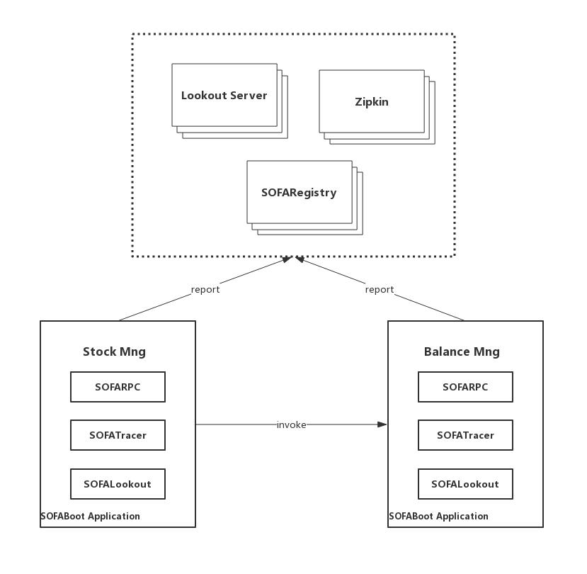

# SOFAStack 关键要素

本实验基于 SOFAStack 快速构建一个微服务，主要包括以下几个部分：

- 使用 SOFABoot + SOFARPC 发布服务
- 使用 SOFABoot + SOFARPC 调用服务
- 通过 ZipKin 查看 SOFATracer 上报的 Tracer 信息
- 通过 SOFALookout 查看上报的 Metrics 信息

也就是关键因素

- SOFABoot 负责项目的启动
- SOFARPC  负责RPC通信，Client & Server
- SOFATracer Trace，支持ZipKin
- SOFALookout Metrics 负责统计服务情况

架构图

